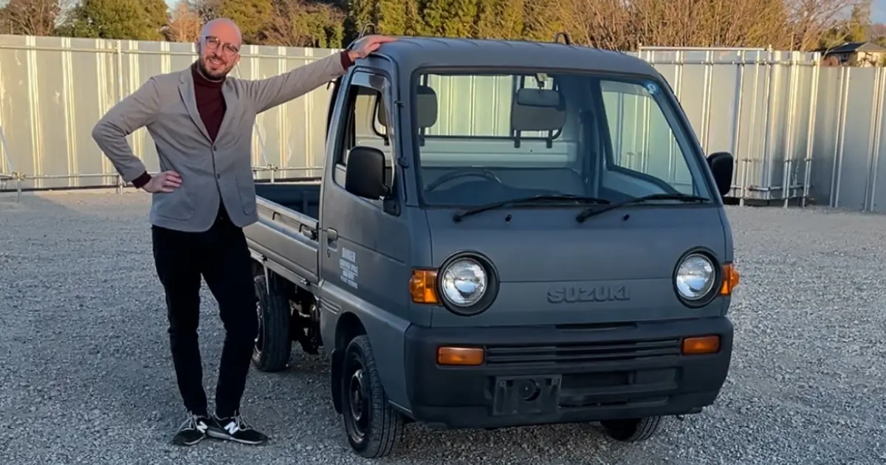

American Kei Class Craze: Japanese Mini Trucks in The US
========================================================

The enthusiasm long held for the cars of “Tokyo Drift” - is now spilling over into more eccentric corners of the JDM fandom.

If you searched for this, you probably saw one or more Japanese mini trucks on American streets and wondered why.

Why are these odd little vehicles experiencing such a boom in popularity?

At first glance, it seems like the explanation is easy: they’re very cheap for what they provide. With nearly all the features of a fully-loaded UTV, a kei-class truck offers similar function at a fraction of the cost. The highest-trim Polaris Rangers start at $39,999 - while an export-eligible Honda Acty can sell for under $1,000 at a Japanese auction house.

But it isn’t just cost performance that’s got Americans suddenly searching for Japanese mini trucks. A whole new fandom is forming in the US - all for a vehicle seen as completely mundane by the average motorist in Japan.

The History of American JDM Hype
--------------------------------

While few will admit it, many Americans who were approaching driving age around the release of the 2001 film “Fast and Furious”, were first exposed to Japanese Domestic Market, or “JDM” vehicles through the colorful cast of cars featured in the franchise.

One could argue that the “Need for Speed” and “Gran Turismo” games played equally important roles - but the true data is impossible to measure.

Only one thing is certain: that images of heavily modified and questionably stylized vehicles will forever come to mind at the mention of JDM subculture.

<small>90's JDM Honda Integra spotted in Akihabara with "itasha" 痛車 styling</small>

For me personally, I would have never wanted a Mitsubishi Lancer Evolution VII at age 13, had I not seen Paul Walker driving his.

The era left such a mark on me that when I could finally buy my own car (with an extremely predatory loan) I went straight for a 2003 Lancer ES. It lacked the Recaro seats, the Momo steering wheel, and the turbocharged engine - but it provided me with 3,000 pounds of Japanese steel to call my own.

Japanese Mini Truck Mania
-------------------------

But as far as the movies tell us, Vin Diesel and Paul Walker never drove Japanese mini trucks. Yet at some point in recent years, it became normal to hear the Suzuki Carry mentioned in the same breath as the Nissan Silvia.

That’s because the enthusiasm long held for the cars of “Tokyo Drift” - is now spilling over into more eccentric corners of the JDM fandom.

Americans are deciding that the Toyota Hiace and the Mitsubishi Star Wagon make for excellent “van life” vehicles. Others are beginning to choose the Suzuki Jimny and the Mitsubishi Pajero Mini over American off-roading alternatives.

But of all the niche pursuits in American JDM culture - nothing seems to compare to the growing popularity of Japanese mini trucks.

<small>A Honda Acty I poorly photoshopped in the style of a retro magazine ad</small>

Kei Vehicles at a Glance
------------------------

So what exactly defines a “kei-class” vehicle?

The word “Kei” comes from the pronunciation of the Japanese character 軽, meaning “light.” The classification itself was invented by the Japanese government way back in 1949 as a way to boost car sales, and grow the nation’s auto industry.

Today, kei ownership in Japan comes with tax breaks, cheaper insurance, and makes driving a more practical option in crowded cities with narrow streets and tight parking.

I myself have had the privilege and pleasure of taking a Suzuki Hustler on a Costco run in the Tokyo Suburbs.

<small>I'm only 5'10'' and I'm standing directly in front of this</small>

And while I did feel a bit like a Simpsons character standing next to the thing, all of my apprehensions vanished once behind the wheel. The benefits of driving a smaller vehicle were immediately apparent, especially to someone used to much wider American roads.

The 25 Year Rule
----------------

So how are people getting all of these mini trucks out of Japan?

Well, thanks to a federal exemption, Americans have been able to import JDM vehicles into the US, so long as they are at least 25 years old. That’s why the Skyline R34 began slowly appearing on American streets in 2023 - it had finally celebrated its 25th birthday.

The reason for waiting 25 years is to legally qualify for exemption from safety and emissions requirements. Once a car is deemed “classic” or “collectable” enough - it no longer needs to meet any of the usual standards. This is how Americans have been able to get license plates on their old Skylines and Silvias.

<small>Late 70's / Early 80's Toyota TownAce spotted in Morishita</small>

When it comes to mini trucks however, not every state shares the same amount of kei-class pride. Experiences can vary from county to county, from DMV to DMV, with the fate of a kei truck’s registration ultimately relying on the mood of whoever is working the counter on that particular day.

Netizens on Reddit and other online forums have shared horror stories of going through all the trouble of importing a kei truck, only to be stonewalled by a surly DMV clerk who’s never seen a Japanese VIN number. Worse yet- some folks have even reported their registrations being revoked retroactively, after a DMV decided months later, that they had issued their license plates in error.

The Chicken Tax
---------------

Another unfortunate piece of kei truck trivia involves a famous tariff known as “The Chicken Tax.”

Any American importing a Japanese mini truck into the US can expect to be hit with a whopping 25% tax at the port. And like the above-mentioned 25 year rule, it wouldn’t be unreasonable to suspect it has less to do with safety - and more to do with politics.

After all, the origins of the chicken tax come from an act presidential revenge nearly 60 years ago.

A kei truck put to work as a "Yaki Imo" baked sweet potato stand in Tsukishima

In the years following the Second World War, the United States began exporting a huge amount of chicken to Europe. The massive influx of American poultry caused local French and West German farmers to take a massive financial hit. In a short time, both countries would lose nearly a quarter of their business to US imports.

The European solution was to impose heavy tariffs on American chicken imports. The American response to this - was to impose heavy taxes on European vehicles.

The intended targets were specifically the Volkswagen Type 2, and other “light” trucks of their day. An act of petty retaliation from a government with a grudge - leaving kei truck fans to pay the cost all these years after.

The Future of American JDM Hype
-------------------------------

Despite the challenges associated with getting your hands on a Japanese mini truck of your own, Americans are continuing to embrace the charm and versatility of these vehicles.

The appeal of Japanese mini trucks continues to grow. Their practicality, affordability, and unique design make them an appealing option for whatever purpose you've imagined yourself using them for.

As American JDM hype evolves, it will be fascinating to see how the kei-class craze develops in the coming years. Will they become a mainstream commodity? Or will they see themselves banned entirely from US roads? Only time will tell.