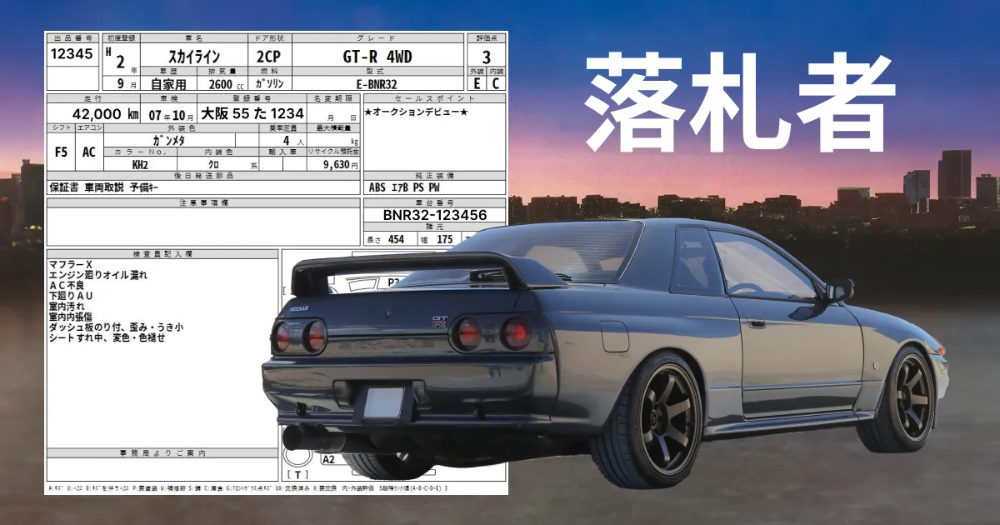

How to Read a Japanese Auction Sheet
====================================

Japanese car auctions are a game of both luck and skill. Do everything you can to tip the odds in your favor.

When bidding on the JDM car of your dreams, knowing how to read a Japanese auction sheet is by far the most important skill to master.

Before bidding at a car auction
-------------------------------

After weeks of searching, you've finally found the perfect export-eligible JDM dream machine.

It's the exact make, model, and trim you've been hoping would show up at an auction - and now the day has come. Only trouble is, you're still left with some questions.

*   _"Am I 100% sure this car is in acceptable condition?"_
*   _"How much is the condition going to affect my bid?"_
*   _"Should I even bid at all?"_

And the only clues you have in front of you - are in Japanese.

Your exporter (if they're a good one) will translate everything for you, line by line.

But learning how screen out deal breakers and spot bonus points on your own - can give a serious boost to your overall JDM importing abilities.

### Evaluation points and vehicle conditions

There is a single numerical score in the upper right hand corner of every Japanese auction sheet.

With a maximum achievable score of 6, it can be difficult to estimate a given car's condition based on this number alone. Here are some very simplified explanations of each score:

**6** - almost brand new  
**5**\- exceptional  
**4.5** - very minor dents and dings  
**4** - still above average  
**3.5** - average (for its age)  
**3** - getting rougher  
**2** - asking for trouble

There are also two special grades which denote an accident history and use the letter R to represent "repaired."

**RA** - small repairs have been made  
**R** \- a substantial amount of repairs have been made

While an R grade can (and should) scare you away in many cases - there are some situations where it won't necessarily be a deal breaker.

One good example is seen in cars that are often abused by their owners.

Spend any amount of time browsing auction listings - and you'll soon realize, it can be hard to find a Lancer Evolution or Nissan Silvia that _isn't_ an R grade.

### General information

Some details, like a car's mileage or displacement, will be readily identifiable regardless of your Japanese ability.

But just about everything else will not be so easy to interpret at first.

Even the car's first registration year will be written using the Japanese calendar. So you'll need to learn to convert the dates.

In the example above, **H2** means "**Heisei 2."** Which to Americans - means 1990.

Words like diesel (軽油) and gasoline (ガソリン) will likely never be written in English. The same will be true for the name of the car itself.

Japanese beginners might be pleased to learn that almost all car names are written phonetically. So learning how to sound out the names of your favorite cars can be a fun way to practice your Katakana alphabet.

**su-ka-i-ra-i-n** (スカイライン) = "Skyline"  
**ra-n-sa-a** (ランサー) = "Lancer"  
**su-u-pu-ra** (スープラ) = "Supra"

### Sale point vocabulary

Sale points are the items listed just below the evaluation score.

Some sale points will be tailored to a specific demographic of buyer, based on the type of car.

To continue picking on Evo enjoyers - a Lancer Evolution might have things like Recaro seats, or Momo steering wheels listed as sale points.

While this could make one person rub their hands together excitedly - someone looking to turn a Toyota High Ace into a stealth camper probably couldn't care less.

That said, there are some common universal sale points that every auction attendee should keep their eyes open for. Some examples could be:

**ワンオーナー** one owner  
**オークションデビュー** auction debut (sometimes written as 初出品)  
**記録簿 -** maintenance records intact

And if you are an aftermarket parts enjoyer after all - be on the lookout for anything listed as **社外** , which literally means "company outside."

**社外マフラー** \- aftermarket muffler  
**社外アルミ** \- aftermarket wheels  
**社外ステアリング** \- aftermarket steering wheels  
**社外車高調** - aftermarket (adjustable) suspension  
**社外インテーク** \- aftermarket intake

### Caution point vocabulary

Some very mechanically-inclined buyers will have very few deal breakers.

Some may even have no deal breakers at all.

I have one client whose only requirements are that a car both "drives" and "brakes." No matter how much I try to talk them out of taking a risk on a really rough car, they always reply the same way.

"Does it drive and brake? If so, please bid."

For everyone else, here are some common deal breakers to look for:

**オイル漏れ** \- oil leak  
**下回りサビ** - undercarriage rust (sometimes written as 錆)  
**下回りフショク** \- undercarriage corrosion (sometimes written as 腐食)  
**フショク穴 -** corrosion to the point of holes forming  
**排気漏れ** - exhaust leak

### Abbreviations

The fastest way to mark and assess a vehicle's condition - is to use abbreviations in place of Japanese.

These letters (or some variation of them) can be seen on every single auction sheet out there - regardless of the auction house.

Each of the letters can be followed by a number which represents severity.

For example, "A1" implies a light scratch - while "A4" suggests a very deep scratch that is unlikely to be repaired easily.

Here are some very simplified explanations of each code:  
  
**A** - scratch  
**P** - paint damage (fading, peeling)  
**U** - dent  
**B** - dent with scratches  
**G** - glass damage (chips, cracks)  
**W** - a visible wave or warping of a panel  
**S** - rust (including age-appropriate, surface-level rust)  
**C** - corrosion (heavier rust, actual metal rot)  
**X** - something missing entirely  
**XX** - something replaced entirely

### Due diligence and quality control

The auction sheet is the beginning and the end of due diligence and quality control for a lot of hopeful JDM importers.

But it doesn't have to be.

Your exporter (if they're a good one) should be able to help with any of the following:

*   ordering physical inspections
*   taking additional photos / videos
*   obtaining the vehicle's auction history

While there may always be unforeseen issues and unavoidable circumstances - doing your homework to the best of your ability can greatly reduce your risk of having a poor JDM import experience.

Japanese car auctions are a game of both luck and skill - but at the end of the day, they are still a game.

So when gambling on used cars from thousands of miles away, in an entirely different country - it's in your best interest to do everything you can to tip the odds in your favor.